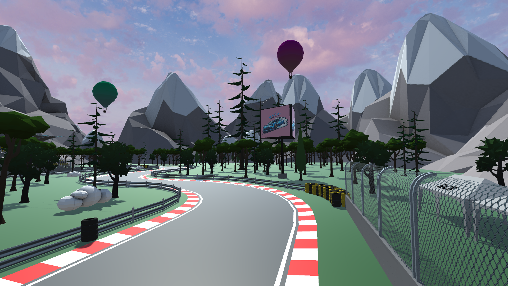
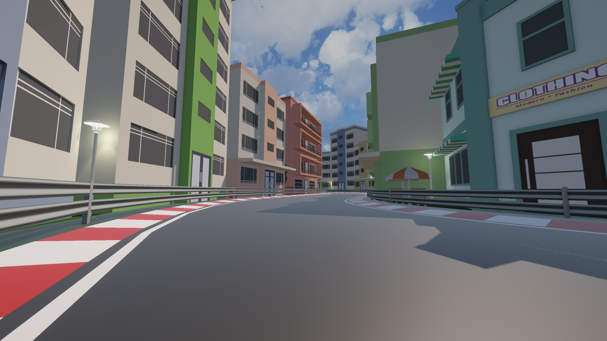

## Overview

Mini Racers is a car racing game offering a single player game mode in order to challenge yourself with the aim of improving your own lap times.
Mini Racers also has a split-screen game mode to compete against your friends.

Enjoy 2 thrilling circuits and get behind the wheel of 30 free playable cars for a fun racing experience accessible to all !

The game is available on Windows and MacOs.

You can check the official website [here](https://mini-racers.vercel.app/)

## Download Link

You can download [Mini Racers here](https://drive.google.com/drive/u/3/folders/1Jze32y9BgvrvcKYuRGH-pBnCYUIwUMSf)

---

  
  

---

## Technologies

### Game Development

- Unity
- C#
- Mirror

### Website

| Back-end | Front-end       |
| -------- | --------------- |
| Bcrypt   | Vue.js 3 + Vite |
| Cors     | Axios           |
| Express  | Pinia           |
| Mongoose |
| Nodemon  |

## Communication

If you have any questions or need more information, you can contact the members who helped make this project possible.

## Team Mini Racers contact

- [Morgan](https://github.com/Morg92b)
- [Dylan](https://github.com/Bruqui)
- [Scotty](https://github.com/scotty800)
- [Steven](https://github.com/S1even)

We really enjoyed doing this project. Thanks for reading.

